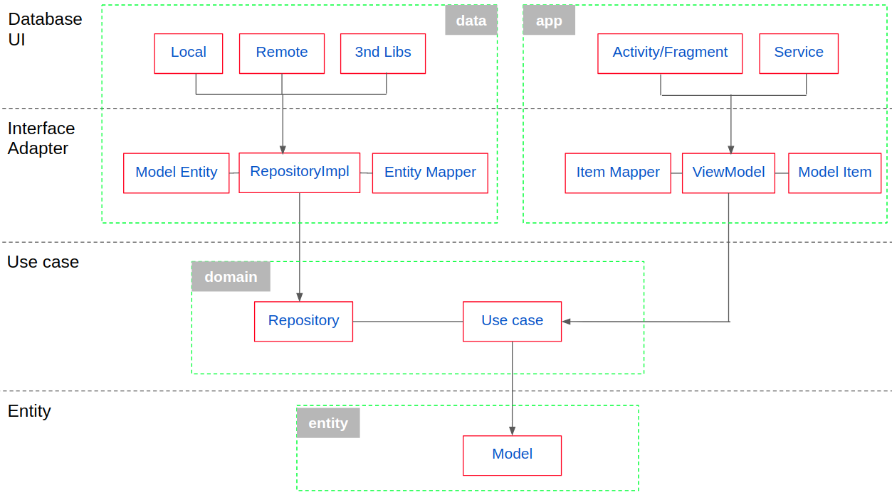

### Android Clean Architecture Diagram

### Document Reference
* [The Clean Code Blog](https://blog.cleancoder.com/uncle-bob/2012/08/13/the-clean-architecture.html)
* [Tiếng Việt](https://nvquangth.github.io/2020/08/20/the-clean-architecture/)

> The Clean Architecture include 4 main layer: App, Data, Domain, Entity. Aside from these layers, it has some layer additional which is utilities layers.

#### App layer
* Android Appliaction
* View(Activity, Fragment, Service...)
* ViewModel
* Mapper

#### Data layer
* Android Libs * 3nd Libs
* API remote
* Database local: Room, Realm...
* Shared Preference
* Internal/External Storage
* Repository Implementation
* Mapper

#### Domain layer
* Kotlin
* Business logic
* Repository Interface

#### Entity layer
* Kotlin
* Model

### Jetpack component
* [Single Activity](https://www.youtube.com/watch?v=2k8x8V77CrU)
* [Navigation](https://developer.android.com/guide/navigation)
* [ViewModel](https://developer.android.com/topic/libraries/architecture/viewmodel)
* [LiveData](https://developer.android.com/topic/libraries/architecture/livedata)
* [Data Binding](https://developer.android.com/topic/libraries/data-binding)

> view more component at https://developer.android.com/jetpack/androidx/explorer

### UI component
* [Material Design](https://material.io/)

> how to use theme, style
>
> sample: https://github.com/material-components/material-components-android-examples

### API Network
* [Retrofit](https://square.github.io/retrofit/)
* [OkHttp](https://square.github.io/okhttp/)

### Thread & Asynchronous
* [Coroutines](https://kotlinlang.org/docs/reference/coroutines-overview.html)

### Dependency Injection
* [Hilt](https://developer.android.com/training/dependency-injection/hilt-android)

### Images
* [Glide](https://bumptech.github.io/glide/)

### Testing
* [JUnit](https://developer.android.com/training/testing/unit-testing/local-unit-tests)
* [Mockito](https://site.mockito.org/)
* [Jacoco Reporter](https://www.eclemma.org/jacoco/)

> run test coverage: ./gradlew clean testDevDebugUnitTestCoverage
>
> view jacoco report at: app/build/reports/jacoco/testDevDebugUnitTestCoverage/html/index.html
>
> view more at gradle.build.kts file

### Style coding
* [ktlint](https://ktlint.github.io/)

> ./gradlew ktlintCheck
>
> ./gradlew ktlintFormat
